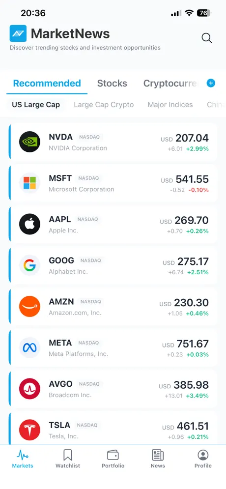
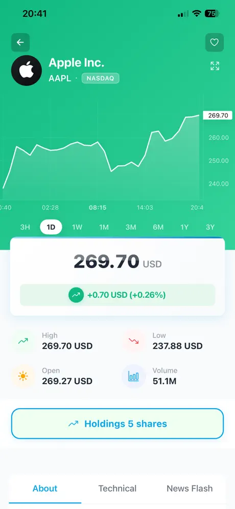
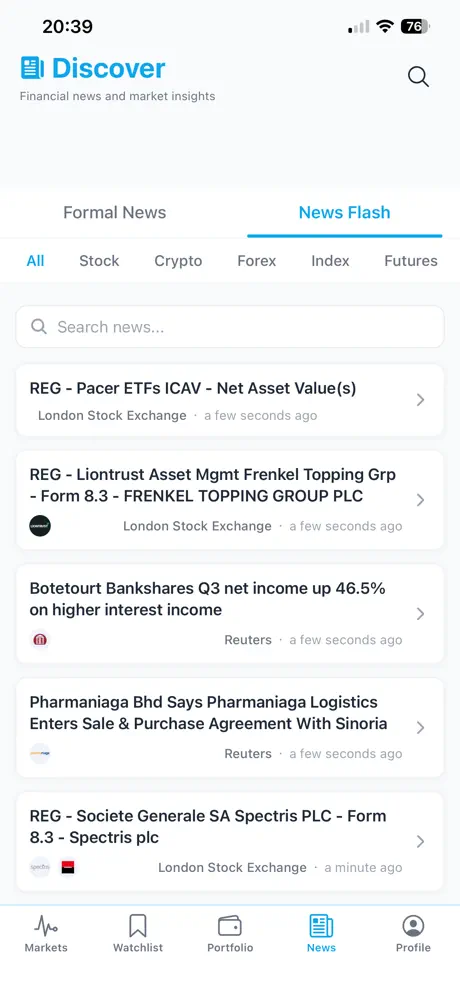
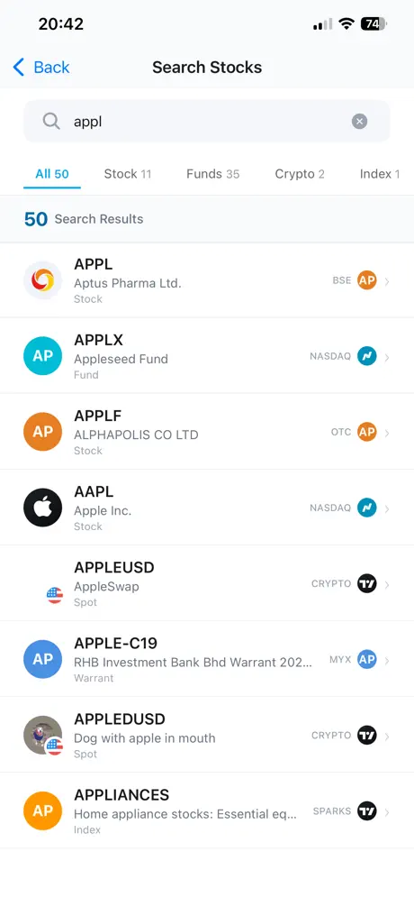
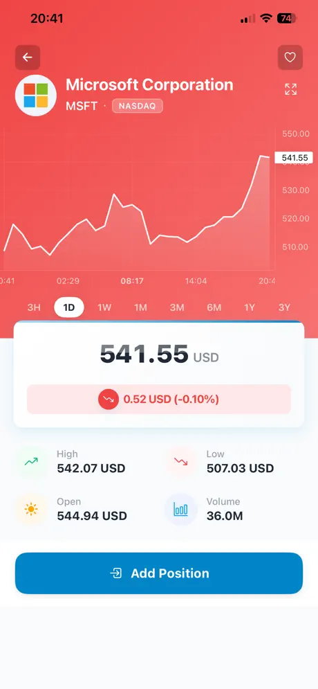
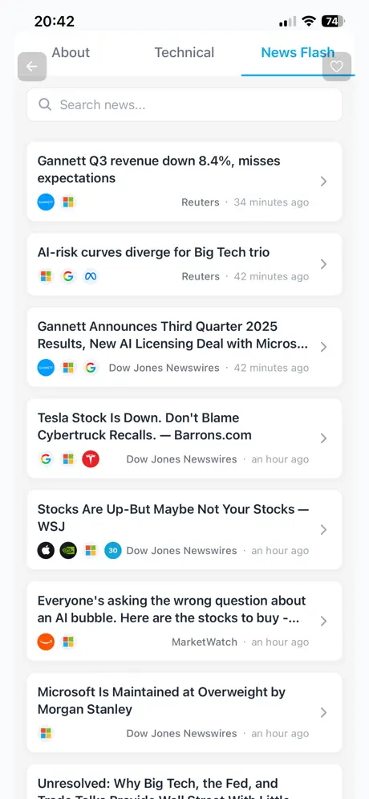
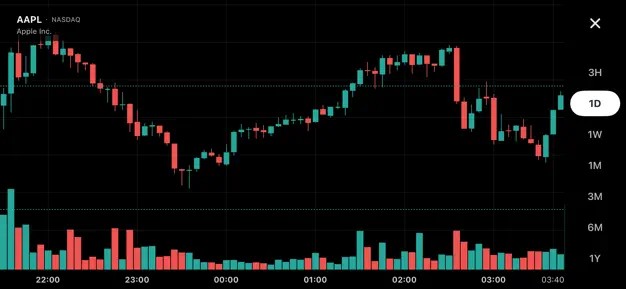

# MarketNews — NavTrend

> **A full-stack, self-hostable stock market mobile application.**
> Real-time quotes, TradingView charts, news feed, portfolio tracking, and watchlists — all in one open-source app.

**Website:** [marketrendnews.top](https://marketrendnews.top/) &nbsp;|&nbsp; **Market Data API:** [tradingviewapi.com](https://www.tradingviewapi.com/)

**Language:** English | [中文](./README.zh.md)

[](LICENSE)
[](https://nodejs.org)
[](https://workers.cloudflare.com)
[](https://expo.dev)
[](https://reactnative.dev)

---

## Screenshots

| Markets | Stock Detail | News | Search |
|:---:|:---:|:---:|:---:|
|  |  |  |  |

| Stock Detail (Down) | Stock News | Candlestick Chart |
|:---:|:---:|:---:|
|  |  |  |

---

## Architecture

This is a **monorepo** containing two independent projects:

```
navtrend-expo-app/
├── navtrend-api/      # Backend — Hono on Cloudflare Workers + D1 + KV
└── navtrend-lite/     # Mobile App — React Native + Expo Router
```

```
Mobile App (Expo)
      │  HTTPS + HMAC-SHA256 Auth
      ▼
navtrend-api (Cloudflare Workers)
      │
      ├── D1 Database (SQLite)   — users, portfolios, watchlists
      ├── KV Cache               — market data cache
      └── TradingView API        — real-time quotes, news, charts
             via tradingviewapi.com (RapidAPI)
```

---

## Features

| Feature | Description |
|---|---|
| Real-time Quotes | Live stock prices via TradingView API |
| TradingView Charts | Interactive K-line charts with technical indicators |
| News Feed | Market news aggregated per symbol |
| Portfolio | Track holdings, average cost, P&L |
| Watchlist | Multi-symbol watchlist with sync |
| Leaderboard | Market movers / top performers |
| Auth | Clerk OAuth (Apple, Google, email) |
| Multi-language | en, zh, ja, ko, de, id, ms |
| Push Notifications | Configurable quiet hours and daily limits |

---

## Prerequisites

Before you start, make sure you have accounts and keys for the following services:

| Service | Purpose | Link |
|---|---|---|
| [Cloudflare](https://cloudflare.com) | Deploy Workers, D1, KV | Free tier available |
| [Clerk](https://clerk.com) | User authentication | Free tier available |
| [RapidAPI — TradingView](https://rapidapi.com/hypier/api/tradingview-data1) | Market data (quotes, news, charts) | Paid API via RapidAPI |
| [Expo / EAS](https://expo.dev) | Build & publish mobile app | Free tier available |
| Apple Developer / Google Play | App Store submission | Paid accounts |

**Local tools required:**

```bash
node >= 18.0.0
npm  >= 9.0.0
wrangler  # Cloudflare Workers CLI
eas-cli   # Expo Application Services CLI
```

Install CLIs:

```bash
npm install -g wrangler eas-cli
```

---

## Quick Start

### Step 1 — Clone & install

```bash
git clone https://github.com/your-org/navtrend-expo-app.git
cd navtrend-expo-app

# Install API dependencies
npm run api:install

# Install mobile app dependencies
npm run lite:install
```

### Step 2 — Configure the API backend

```bash
cd navtrend-api
cp .dev.vars.example .dev.vars
# Edit .dev.vars — fill in your RAPIDAPI_KEY, CLERK_SECRET_KEY, etc.
```

See **[navtrend-api/README.md](./navtrend-api/README.md)** for full Cloudflare setup and deployment instructions.

### Step 3 — Configure the mobile app

```bash
cd navtrend-lite
cp .env.example .env
# Edit .env — fill in your API URL, CLERK_PUBLISHABLE_KEY, etc.
```

See **[navtrend-lite/README.md](./navtrend-lite/README.md)** for full EAS build and publishing instructions.

### Step 4 — Run locally

```bash
# Terminal 1 — start API (http://localhost:8787)
npm run api:dev

# Terminal 2 — start mobile app (Expo Metro)
npm run lite:dev
```

---

## Project Docs

| Project | README | Description |
|---|---|---|
| `navtrend-api` | [navtrend-api/README.md](./navtrend-api/README.md) | Backend API — config, DB setup, deploy to Cloudflare |
| `navtrend-lite` | [navtrend-lite/README.md](./navtrend-lite/README.md) | Mobile App — env config, EAS build, App Store submit |

---

## Contributing

Pull requests are welcome. For major changes, please open an issue first to discuss what you would like to change.

1. Fork the repo
2. Create your feature branch: `git checkout -b feature/my-feature`
3. Commit your changes: `git commit -m 'feat: add my feature'`
4. Push to the branch: `git push origin feature/my-feature`
5. Open a Pull Request

---

## License

[MIT](LICENSE)
